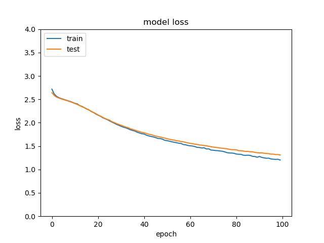

# Generative Query Network - Analysis of Representations

This is a preliminary analysis of how the number of context images available to form a reconstruction of an object affects the representation of the object in the GQN. The idea was to see if the representations formed using different numbers of context images were distinct enough to be separable by a simple linear classifier.

This repo uses a PyTorch implementation (originally implemented by Jesper Wohlert) of the Generative Query Network (GQN)
described in the DeepMind paper "Neural scene representation and
rendering" by Eslami et al. For an introduction to the model and problem
described in the paper look at the article by [DeepMind](https://deepmind.com/blog/neural-scene-representation-and-rendering/).


## Description of Dataset
This model was pretrained on 10% of the data from the Shepard-Metzler dataset for $2 \times 10^5$ iterations. The pretrained model weights were acquired from https://github.com/wohlert/generative-query-network-pytorch/releases/tag/0.1.

## Method

A section of the Shepard-Metzler dataset was preprocessed. There were 30 unique objects in the subset of the dataset and there were 15 pictures of each object, rotated differently. These rotated pictures form the context knowledge for the GQN to use to then reconstruct the object. 

Reconstruction was performed for each image, changing the number of context images used each time in the range of 2 to 15. After generating reconstructions, the internal representation of object created by the the network was saved. So, for each number from 2 to 15, there were 30 representations of each unique object that were generated using that many context images. This internal representation then formed the training dataset for a simple linear classifier where the labels were the number of context images used to create it. The classifier was trained on 80% of this data and then validated on 20% of it for 100 epochs.

## Initial Results




The accuracy of the classifier does improve as the number of epochs increases. Although not extraordinarily high, the accuracy of the classifier seems to be fairly good. Therefore, it can be concluded that the number of context images given to the GQN plays a significant role in how the internal representation of the object is constructed. It is interesting that even differences of just one image are separable from each other. 

## Future Exploration
This initial analysis opens up several areas of futher investigation.

First, the dataset that this was evaluated on was not very large, due to computing resource and time constraints. It would be ideal if the entire Shepard-Metzler dataset could be reocnstructed and the representations classified to reduce the effect of noise and outliers in the dataset.

Second, the nature of the internal representations could be explored further. This analysis used a 16 by 16 array of the representation as training data for the classifier. There are most likley more nuanced ways of constructing the input to the classifier such that it captures more details about the representation of the object. Related to this, it would be interesting to look at the connections that are formed in the network and relate them to networks that perform similar tasks (object/scene recognition or mental rotation) in the human brain. 

## Further Details

The current implementation generalises to any of the datasets described
in the paper. However, currently, *only the Shepard-Metzler dataset* has
been implemented. To use this dataset you can use the provided script in
```
sh scripts/data.sh data-dir batch-size
```

The model can be trained in full by in accordance to the paper by running the
file `run-gqn.py` or by using the provided training script
```
sh scripts/gpu.sh data-dir
```

